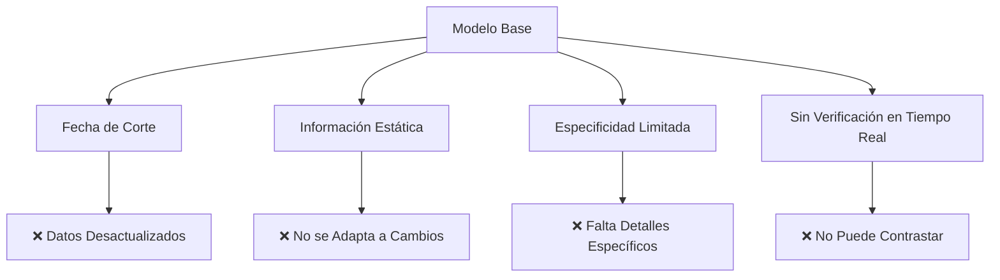
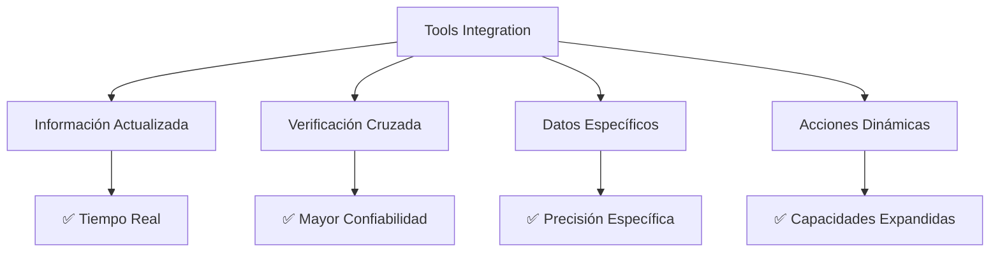
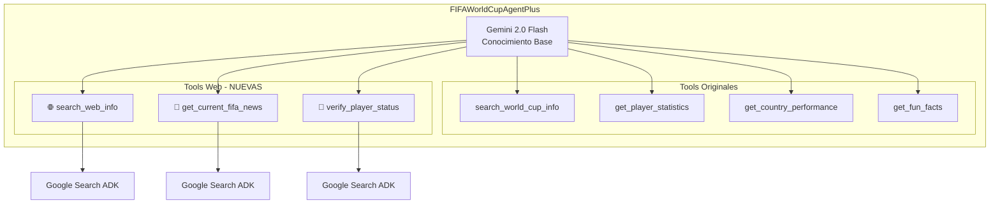
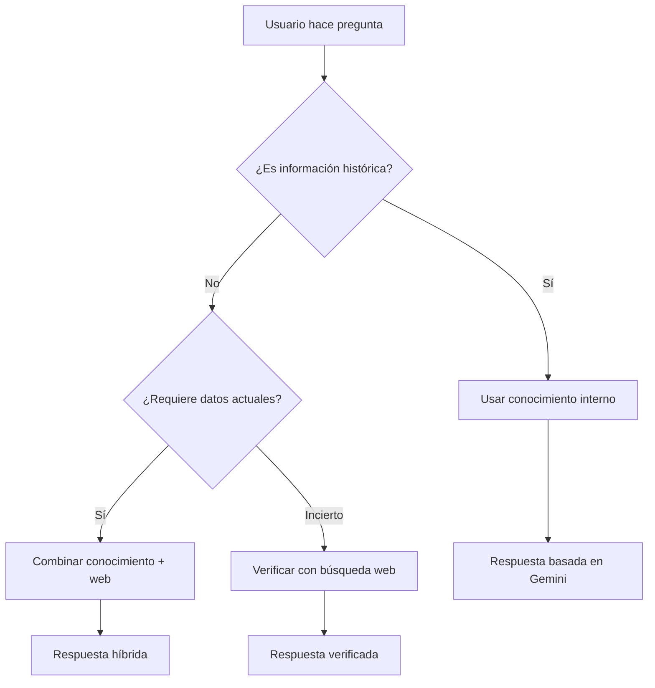

# Módulo 3: FIFA Tools - Herramientas Web con Google Search

## 📋 Descripción del Módulo

Este módulo demuestra cómo expandir las capacidades de un agente ADK usando **herramientas web** integradas. Construimos sobre el FIFA Agent básico añadiendo Google Search nativo para acceder a información actualizada en tiempo real.

## 🎯 Objetivos de Aprendizaje

Al completar este módulo podrás:

- ✅ Entender por qué los agentes necesitan herramientas
- ✅ Conocer los tipos de tools disponibles en ADK  
- ✅ Implementar herramientas de búsqueda web
- ✅ Crear estrategias híbridas (conocimiento + web)
- ✅ Evaluar cuándo usar cada tipo de herramienta

## 🤔 ¿Por qué Usar Tools?

### Limitaciones del Conocimiento Base

Los modelos como Gemini tienen restricciones:



### Beneficios de las Herramientas



## 🛠️ Tipos de Tools en ADK

### 1. Google Search Nativo de ADK
```python
from google.adk.tools import google_search

# Google Search se registra automáticamente en el agente
class FIFAWorldCupAgentPlus(Agent):
    def __init__(self):
        super().__init__(
            name="FIFA Agent Plus",
            model=model,
            tools=[google_search]  # Search automático
        )
```

### 2. APIs Externas  
```python
async def get_weather_data(self, location: str) -> Dict[str, Any]:
    """Integración con servicios externos"""
    pass
```

### 3. Bases de Datos
```python
async def query_database(self, sql: str) -> Dict[str, Any]:
    """Consultas a bases de datos"""
    pass
```

### 4. Herramientas de Análisis
```python
async def analyze_document(self, document: str) -> Dict[str, Any]:
    """Procesamiento de documentos"""
    pass
```

## 🏗️ Arquitectura del FIFA Agent Plus



## 💡 Estrategia de Respuesta Híbrida

El agente usa una lógica inteligente para decidir qué herramientas usar:



## 📊 Ejemplos de Casos de Uso

### Caso 1: Información Histórica
```
👤 Usuario: "¿Quién ganó la Copa del Mundo de 1998?"

🤖 Agente: 
1. Detecta: información histórica
2. Usa: search_world_cup_info("ganador", 1998)  
3. Responde: con conocimiento interno (suficiente)
```

### Caso 2: Información Reciente
```
👤 Usuario: "¿Qué equipos se clasificaron para el Mundial 2026?"

🤖 Agente:
1. Detecta: información futura/actual
2. Usa: search_web_info("clasificados Mundial 2026")
3. Responde: combinando conocimiento + datos web
```

### Caso 3: Estado de Jugador
```
👤 Usuario: "¿Messi sigue en el PSG?"

🤖 Agente:
1. Detecta: estado actual específico
2. Usa: verify_player_current_status("Lionel Messi")
3. Responde: con información verificada y actual
```

## 🔧 Implementación Técnica

### Instalación de Dependencias
```bash
pip install google-adk
```

### Configuración del Agente con Google Search
```python
from google.adk import Agent
from google.adk.models.google_llm import Gemini
from google.adk.tools import google_search

class FIFAWorldCupAgentPlus(Agent):
    def __init__(self):
        model = Gemini(
            model="gemini-2.5-flash",
            location="us-central1",
            api_key=os.getenv("GOOGLE_API_KEY"),
            temperature=0.7
        )
        
        super().__init__(
            name="FIFA_World_Cup_Expert_Plus",
            description="Experto FIFA con herramientas web",
            model=model,
            instruction=SYSTEM_PROMPT,
            tools=[google_search]  # Google Search nativo incluido
        )
```

### Sistema de Prompts Inteligente

El agente utiliza un prompt del sistema avanzado que instruye a Gemini 2.5 Flash sobre cuándo usar Google Search:

```python
SYSTEM_PROMPT = """
Eres un experto en la Copa Mundial de la FIFA con conocimiento extensivo desde 1930 hasta 2022.

PROTOCOLO DE BÚSQUEDA:
1. PRIMERO: Usa tu conocimiento interno extensivo para responder
2. SI NO TIENES la información específica o es sobre eventos de 2024-2025: USA google_search inmediatamente
3. Situaciones donde DEBES usar google_search:
   - Información sobre 2024, 2025 o eventos "actuales/recientes"
   - Noticias de FIFA o fútbol actuales
   - Estado actual de jugadores (club, lesiones, transferencias)
   - Próximos torneos o eventos de FIFA
   - Información que claramente no está en tu conocimiento base

IMPORTANTE: Si la consulta requiere información que no tienes o es sobre eventos posteriores a 2022, usa google_search inmediatamente para obtener datos actualizados.
"""
```

### Herramientas FIFA Mejoradas

```python
class FIFAToolsEnhanced:
    """Herramientas que complementan el conocimiento base con capacidades web"""
    
    async def search_world_cup_info(self, query: str, year: Optional[int] = None):
        """Permite a Gemini buscar información específica sobre Mundiales"""
        return {
            "action": "use_gemini_knowledge",
            "instruction": "Usa tu conocimiento interno sobre la Copa del Mundo"
        }
    
    # Las herramientas web ahora están deprecadas en favor de google_search directo
    async def search_web_info(self, query: str, max_results: int = 3):
        """DEPRECADO: El modelo ahora usa google_search directamente"""
        return {
            "action": "deprecated_method",
            "instruction": "Usa google_search tool directamente para información actualizada."
        }
```

## 🚀 Ejecutar el Laboratorio

### 1. Configuración Inicial
```bash
cd labs/lab-3-fifa-tools
pip install -r requirements.txt
export GOOGLE_API_KEY="tu_api_key_aqui"
```

#### Archivo requirements.txt
```
google-adk>=0.1.0
```

### 2. Ejecución del Agente
```bash
python agent.py
```

**Salida esperada:**
```
🏆 FIFA World Cup Agent Plus - Gemini 2.5 Flash con Google Search
🧠 Capacidades:
   • Conocimiento extenso sobre Copas del Mundo (1930-2022)
   • Búsqueda web en tiempo real con Google Search
   • Estadísticas detalladas de jugadores y países
   • Noticias actuales de FIFA y fútbol
   • Datos curiosos y récords históricos
   • Análisis de rendimiento por países

Ejemplos de consultas:
• '¿Quién ganó la Copa del Mundo 2022?'
• '¿Cuáles son las últimas noticias de FIFA?'
• '¿Cuáles son los máximos goleadores de Mundiales?'
• 'Información actual sobre Messi 2024'
• 'Datos curiosos sobre la Copa del Mundo'
• '¿Cuál fue el mejor Mundial de la historia?'

👤 Tu pregunta:
```

### 3. Pruebas Sugeridas

**Consultas Históricas:**
- "¿Quién ganó en 2018?"
- "¿Cuántos goles hizo Pelé?"

**Consultas Actuales:**
- "¿Cómo va la clasificación para 2026?"
- "¿Qué noticias hay de la FIFA?"

**Verificación de Jugadores:**
- "¿En qué club juega Mbappé?"
- "¿Cristiano está lesionado?"

## 📈 Comparación de Resultados

| Tipo de Consulta | Agent Básico | Agent Plus |
|---|---|---|
| **Datos históricos** | ✅ Excelente | ✅ Excelente |
| **Información reciente** | ❌ Limitado | ✅ Actualizado |
| **Estado de jugadores** | ⚠️ Desactualizado | ✅ Verificado |
| **Noticias FIFA** | ❌ No disponible | ✅ Tiempo real |
| **Verificación de datos** | ❌ No posible | ✅ Cruzada |

## 🎯 Beneficios Clave

### 1. **Precisión Mejorada**
- Combinación de conocimiento base + datos actuales
- Verificación cruzada de información controvertida

### 2. **Experiencia de Usuario Superior**
- Respuestas siempre actualizadas
- Mayor confianza en la información proporcionada

### 3. **Adaptabilidad**
- El agente decide inteligentemente qué herramientas usar
- Respuesta apropiada según el contexto

### 4. **Transparencia**
- Fuentes verificables
- Origen claro de los datos

## 📁 Estructura del Código

### Archivos Principales
```
labs/lab-3-fifa-tools/
├── agent.py                 # Agente principal con Google Search
├── config.py               # Configuración y prompts del sistema
├── fifa_tools_enhanced.py  # Tools mejoradas con búsqueda web
├── requirements.txt        # Dependencias del proyecto
└── README.md              # Documentación técnica detallada
```

### Configuración del Modelo (config.py)
```python
MODEL_CONFIG = {
    "model_name": "gemini-2.5-flash",
    "project_id": os.getenv("GOOGLE_CLOUD_PROJECT"),
    "api_key": os.getenv("GOOGLE_API_KEY"),
    "location": "us-central1",
    "temperature": 0.7,
    "max_output_tokens": 1500,
}
```

### Clase Principal del Agente (agent.py)
```python
class FIFAWorldCupAgentPlus(Agent):
    def __init__(self):
        model = Gemini(**model_kwargs)
        
        super().__init__(
            name=AGENT_CONFIG["name"],
            description=AGENT_CONFIG["description"],
            model=model,
            instruction=SYSTEM_PROMPT,
            tools=[google_search]  # Google Search nativo incluido
        )
```

## 🔮 Extensiones Futuras

- **Análisis de video**: Highlights y estadísticas visuales
- **APIs oficiales**: Integración con FIFA/UEFA
- **Machine Learning**: Predicciones y análisis
- **Multilingüe**: Soporte en múltiples idiomas
- **Notificaciones**: Actualizaciones automáticas

## 📝 Ejercicios Prácticos

### Ejercicio 1: Consulta Híbrida
Pregunta algo que requiera tanto conocimiento histórico como verificación actual.

### Ejercicio 2: Información Reciente  
Busca noticias sobre el próximo Mundial o torneos actuales.

### Ejercicio 3: Comparación
Compara las respuestas del agente básico vs el agente plus.

## 🎓 Diferencias Clave con el Módulo Anterior

| Aspecto | fifa_agent (Básico) | lab-3-fifa-tools (Plus) |
|---------|---------------------|-------------------------|
| **Modelo** | Gemini 2.0 Flash | Gemini 2.5 Flash |
| **Búsqueda Web** | ❌ No disponible | ✅ Google Search nativo |
| **Tools** | Activación de conocimiento | Híbrido (interno + web) |
| **Información** | Limitada por fecha de corte | Actualizada en tiempo real |
| **Verificación** | No posible | Cruzada con fuentes web |
| **Arquitectura** | Herramientas "simuladas" | Tools funcionales reales |
| **Tokens máximos** | 1000 | 1500 |
| **Configuración** | Básica | Avanzada con protocolo web |

## 📊 Análisis Comparativo Detallado

### Diferencias Arquitectónicas

**fifa_agent (Básico)**:
- Usa herramientas de "activación de conocimiento"
- Solo accede al conocimiento interno de Gemini
- Herramientas que instruyen al modelo sobre qué conocimiento usar

**lab-3-fifa-tools (Avanzado)**:
- Integra Google Search nativo de ADK
- Combina conocimiento interno con búsqueda web real
- Herramientas funcionales que acceden a información externa

### Estrategias de Respuesta

**fifa_agent**: Enfoque de conocimiento puro
```python
return {
    "action": "use_gemini_knowledge",
    "instruction": "Usa tu conocimiento interno sobre la Copa del Mundo..."
}
```

**lab-3-fifa-tools**: Enfoque híbrido inteligente
```python
# Protocolo de 3 niveles:
# 1. Conocimiento interno primero
# 2. Google Search para info actual
# 3. Combinación inteligente de ambas fuentes
```

### Capacidades Expandidas

| Capacidad | fifa_agent | lab-3-fifa-tools |
|-----------|------------|------------------|
| **Información histórica** | ✅ Excelente | ✅ Excelente |
| **Noticias 2024-2025** | ❌ No disponible | ✅ Tiempo real |
| **Estado actual jugadores** | ❌ Limitado | ✅ Verificado |
| **Verificación cruzada** | ❌ No posible | ✅ Activa |
| **Adaptabilidad** | ⚠️ Estática | ✅ Dinámica |

## ✅ Puntos Clave del Módulo

- Los **tools amplían las capacidades** de los agentes más allá del conocimiento base
- **Google Search nativo de ADK** proporciona búsqueda web sin configuración adicional
- Las **estrategias híbridas** combinan lo mejor de ambos mundos
- La **decisión inteligente** sobre qué herramienta usar es crucial
- Las **herramientas web** mantienen la información actualizada
- La **verificación cruzada** mejora la confiabilidad

## 🏁 Próximos Pasos

Has completado el módulo de herramientas web. Tu agente FIFA ahora puede:
- ✅ Acceder a información actualizada via Google Search
- ✅ Combinar conocimiento interno con datos web
- ✅ Verificar información en tiempo real
- ✅ Decidir inteligentemente qué herramientas usar

¡Continúa al siguiente módulo para aprender sobre evaluación y despliegue de agentes! 🚀